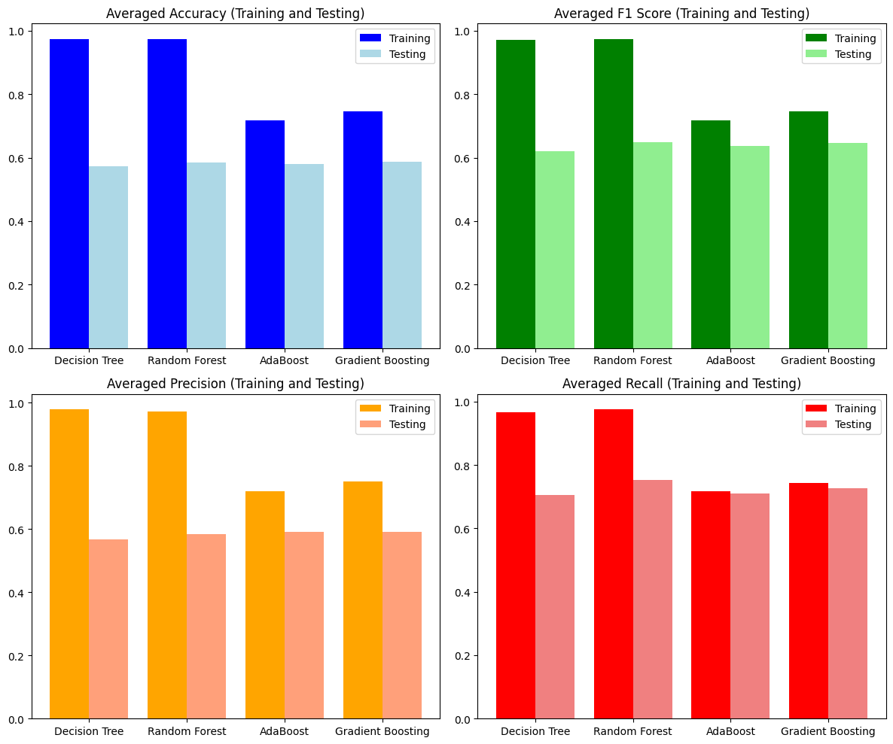
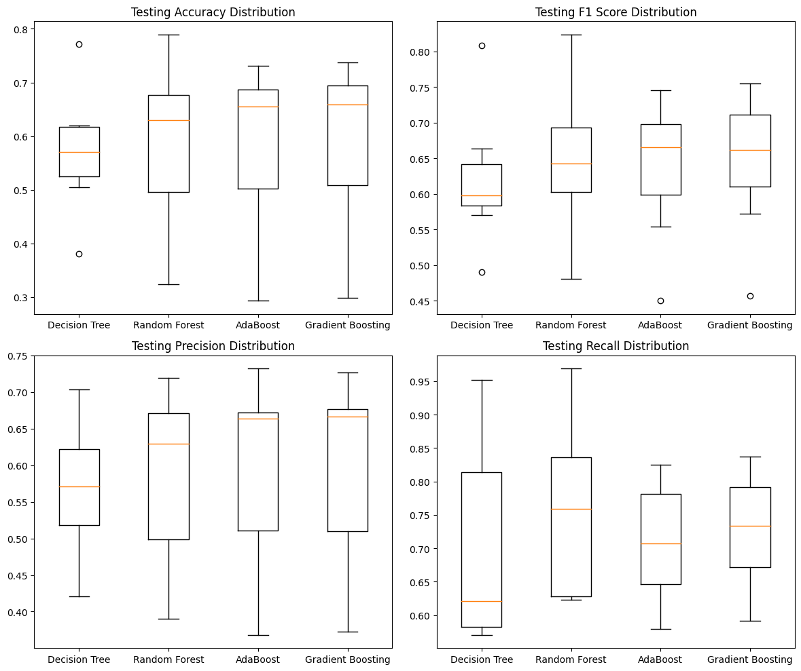

# ML Tree Analysis

## Overview
This project reviews major concepts in tree ensemble learning methods, including bagging and boosting, and empirically compares different decision tree models. The theoretical review can be found in the `Report.pdf`, and the empirical results can be found below.

## Instruction

```bash
git clone https://github.com/ETZET/MLTreeAnalysis.git
cd MLTreeAnalysis
pip install -r requirements.txt
```

The following command will automatically download data from openml, run the experiment and save the result onto a json file.

```bash
python tree.py
```

## Results


***Figure 1: Training vs. Testing Performance Metrics for Decision Tree, Random Forest, AdaBoost, and Gradient Boosting Models.***

Figure 1 bar plots compares the averaged accuracy, F1 score, precision, and recall between training and testing sets for the same four models. Here, a clear trend of overfitting is visible with the Decision Tree and Random Forest models, where the training scores are significantly higher than the testing scores, indicating that these models may not generalize well to unseen data. The AdaBoost and Gradient Boosting models exhibit better generalization with closer training and testing scores. Notably, Gradient Boosting maintains high levels of both training and testing metrics, suggesting it is the most effective model among those compared for balancing bias and variance, thus yielding a model that performs well on both seen and unseen data.



***Figure 2: Comparative Distribution of Testing Metrics Across Decision Tree, Random Forest, AdaBoost, and Gradient Boosting Models.***

Figure 2 depicts the distribution of testing accuracy, F1 score, precision, and recall for four different machine learning models: Decision Tree, Random Forest, AdaBoost, and Gradient Boosting. It is evident that Gradient Boosting tends to have a higher median testing accuracy and F1 score, as well as less variance in its accuracy distribution, indicating more consistent performance across different runs. The AdaBoost model also shows robustness, with a narrower interquartile range in precision and recall, though with a few outliers indicating some variations in performance. The Decision Tree model appears to be the least stable, with the widest distribution in accuracy and F1 score, suggesting its performance is more sensitive to the variations in the testing data.

Based on the visualizations, we can draw several conclusions about the performance of the four machine learning models. The Gradient Boosting model stands out as the most proficient, demonstrating high and consistent scores across all metrics, with a strong balance between training and testing results which indicates good generalization without significant overfitting. The AdaBoost model follows as a close competitor, with relatively stable performance metrics and fewer outliers, suggesting resilience to data variability. However, it doesn't reach the same peak performance as Gradient Boosting. The Random Forest model, while showing promising training results, reveals a tendency to overfit, as seen by the drop in testing metrics. The Decision Tree model, although simple and interpretable, shows the most variability and the lowest scores in testing metrics, suggesting it may be too simplistic to capture the complexities in the data as compared to the ensemble methods. These insights would favor Gradient Boosting as the preferred model for this particular dataset, given its superior and more reliable predictive performance.

## Discussion
The empirical evaluation, conducted on seven benchmark datasets for binary classification tasks, provided a thorough examination of decision tree, random forest, AdaBoost, and gradient boosting models. Leveraging key evaluation metrics such as accuracy, F1 score, precision, and recall, we gained a nuanced understanding of their respective performances.

The findings revealed that gradient boosting emerged as a standout performer, demonstrating superior and consistent predictive capabilities across various metrics. Its ability to balance bias and variance, showcasing high generalization without overfitting, positions it as a compelling choice for the explored dataset. AdaBoost exhibited resilience to data variability but fell slightly short of the peak performance achieved by gradient boosting. Random forests, while promising in training, displayed a tendency to overfit, and basic decision trees exhibited the most variability and comparatively lower testing metrics.
